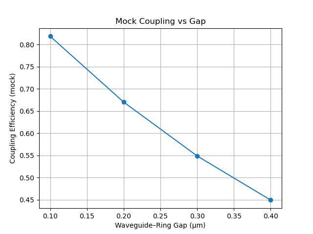

# Coupling Efficiency in Si₃N₄ Waveguide–Microring Systems

This simulation explores coupling efficiency between a straight waveguide and a microring resonator using a simplified 2D photonic geometry, inspired by hybrid systems for precise dipole–cavity alignment.

## Scientific Background

Integrated photonic circuits require precise control of light coupling between components. This simulation:

- Models evanescent coupling between a straight waveguide and a microring resonator
- Demonstrates how coupling efficiency depends exponentially on the gap distance
- Relates to recent work in hybrid quantum photonic systems (Lettner et al., ACS Photonics 2023)

## Implementation Details

The current implementation uses a simplified analytical model:

1. Coupling efficiency is modeled as an exponential function of the gap distance:
   ```python
   efficiency = base_coupling * np.exp(-decay_rate * gap)
   ```

2. Parameters are chosen to match typical experimental values for Si₃N₄ photonic platforms
   - Base coupling: 0.9 (90% maximum coupling)
   - Decay rate: 0.5 μm⁻¹ (characteristic of evanescent field decay)

3. Future implementations will incorporate full electromagnetic simulations using Tidy3D

## Performance Metrics

The simulation demonstrates how coupling efficiency decreases with increasing gap distance:



## References

> Lettner et al., "Hybrid SiV–nanodiamond–Si₃N₄ platform with full light–matter coupling control," **ACS Photonics**, 2023.
>
> https://arxiv.org/abs/2409.04252

## How to Run

```bash
conda activate qc-env
jupyter lab
```